[comment]: <> (Export with https://dillinger.io/)

# My Gradle Way

## Setup 

### Windows

Let's start with an harmless setup. Create a directory and extract all the following "portable servers" (they can be founded, with others at http://kendar.org/?p=/system/portableservers). If you had already installed a JDK from the same source remember to choose the jdk-11.

 * Portable servers Common: http://www.kendar.org/hugefiles/portable-server-commons-2.0.0.zip
 * Gradle: http://www.kendar.org/hugefiles/gradle-6.0.1.zip
 * OpenJDK 13: http://www.kendar.org/hugefiles/jdk-13.0.1.zip
 
Then you can run "pgradle.bat" directly from explorer and go into the directory in wihich you will create your projects

## 000-Create a simple application

### Preparation

 * Create directory "demo000" and enter it
 * Run 'gradle init' and select the following to setup a simple stub application with unit tests
    * Type "1: base"
    * Script DSL "1: Groovy"
    * Project name, leave it blank (default)
    * Source package set it to "org.demo"
    
    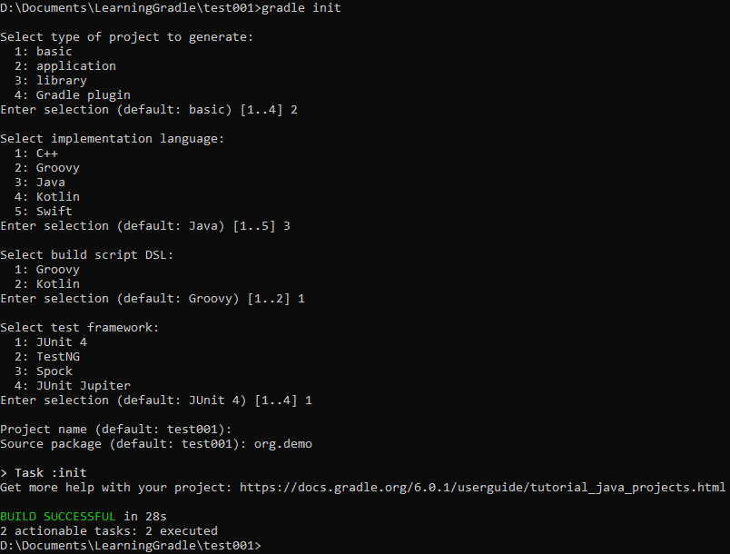
    
 * We can then build the project running "gradle build"
    
    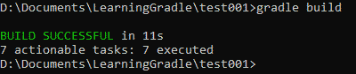
    
 * Now we can see several commands to analyze the project
    * gradle projects: List the projects structure
    * gradle tasks: Show all the available tasks
    
    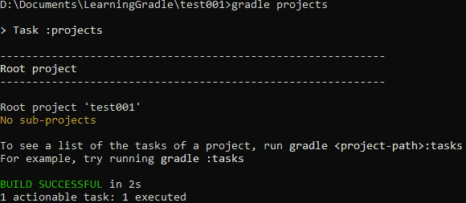
    
    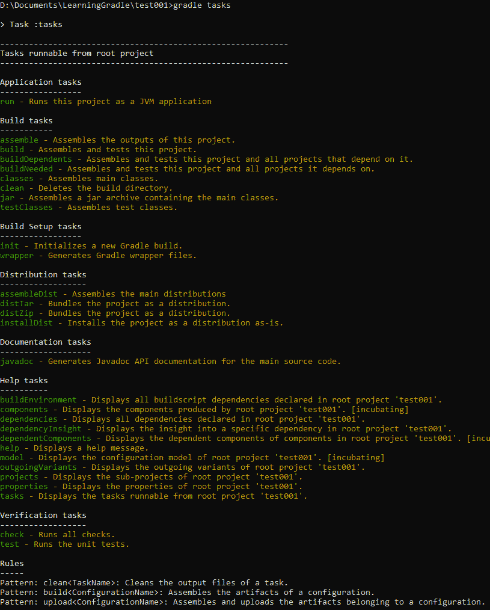
    
### File structure

 * gradlew.bat: A wrapper for gradle, in windows is gradlew.bat, on linux is gradlew.sh
 * settings.gradle: Settings for the gradle build
 * build.gradle: The tasks definition for the build
 * gradle: (directory) Contains a stand-alone gradle to be used by gradlew
 * src: (directory) Contains the sources for the project
   
## 001-Create an application with root project

The aim of this part is to create an application inside a project. Like with the maven "pom" project types

### Preparation

 *Create directory "demo001" and enter it
 * Run 'gradle init --type basic' and select the following to setup a simple stub
    * Script DSL "1: Groovy"
    * Project name, leave it blank (default)    
 * Now a new project without sources has been created
 * Add then inside the build.gradle the following lines

        plugins {
            id 'base'
        }

Remember the Gradle builds use (for our tutorial) groovy as a language. With the previous lines we are loading the plugins that are part of the current project build
 
### Creating a 'main' supbroject

We will add to the main "settings.gradle" the following line
	
        include 'startup'

To be fair, only one level of nesting is encouraged, because of some glitchy behaviour of gradle with nested projects (something that in maven you can't see...but think about the problem this carried)

The name of the project IS the name of the directory in which you will put the new build.gradle script

#### With a simple helper

I created a small script to initialize the directory "mksrc.bat". Supposing our demo001 project is in C:\Documents we will call the following to create a java project with Maven group org.kendar and version 1.0.0-SNAPSHOT

	    mksrc C:\Documents\demo001\startup java org.kendar 1.0.0-SNAPSHOT

The source is

	@echo off
	set DEST_DIR=%1
	set PRJ_TYPE=%2
	set PRJ_GROUP=%3
	set PRJ_VERSION=%4

	mkdir %DEST_DIR%

	echo plugins {>%DEST_DIR%\build.gradle
	echo    id '%PRJ_TYPE%'>>%DEST_DIR%\build.gradle
	echo }>>%DEST_DIR%\build.gradle
	echo group '%PRJ_GROUP%'>>%DEST_DIR%\build.gradle
	echo version '%PRJ_VERSION%'>>%DEST_DIR%\build.gradle

	mkdir %DEST_DIR%\src\main\java
	echo empty>%DEST_DIR%\src\main\java\.gitkeep
	mkdir %DEST_DIR%\src\main\resources
	echo empty>%DEST_DIR%\src\main\resources\.gitkeep

	mkdir %DEST_DIR%\src\test\java
	echo empty>%DEST_DIR%\src\test\java\.gitkeep
	mkdir %DEST_DIR%\src\test\resources
	echo empty>%DEST_DIR%\src\test\resources\.gitkeep
 
#### By hand

Create a directory under demo001, let's call it "startup"
Add a new fle under it called "build.gradle". This is the equivalent of the maven pom
We should then add

 * Project type (java)
 * Maven group
 * Version
 	
    	plugins {
    	    id 'java'
    	}
    
    	group 'org.kendar'
    	version '1.0-SNAPSHOT'

And add all directories (src test etc)
 
### Finally 

Now running the "gradle projects" command from demo001 directory you will find the demo001 project plus all its referenced projects!

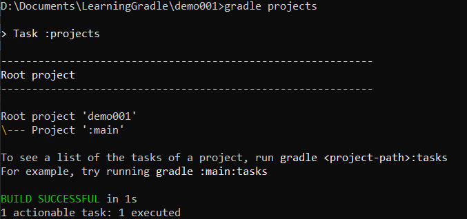

Then you can add a class in demo001\startup\src\main\java\org\kendar\HelloWorld.java

Containing

    package org.kendar;
    
    public class HelloWorld {
        public static void main(String[] args) {
            System.out.println("Hello World\n");
        }
    }

And finally run "gradle jar" and you will find the jar inside the directory "demo001\startup\build\libs"

### Running the jar

You now want to run your project. Simply add in startaup\build.gradle the plugin 'application' and the class to start. This is how the file should look like

    	plugins {
    	   id 'java'
    	   id 'application'
    	}
    	group 'org.kendar'
    	version '1.0.0-SNAPSHOT'
    
    	application {
    	    mainClassName = 'org.kendar.HelloWorld'
    	}

Now you can start the application with
	
	    gradle run

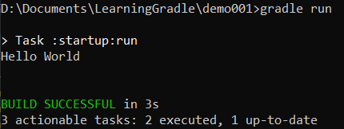

From now on you can find inside demo001\startup\build the directory "scripts" and "lib" that contains a batch to run the jar and the jar itself with its needed libraries

You can look [here](https://docs.gradle.org/current/userguide/application_plugin.html) for further references on the application plugin

## 002-Adding internal dependencies

We add now a dependency. We will create a new application called demo002 identical to the demo001.

It is possible to directly copy the content of demo001 into the new demo002 directory and rename the project inside the demo002\settings.gradle to demo002

Then we create a new "services" subproject excatly as we previously did with the startup project calling (with the demo002 project inside the "C:\Documents" directory) and adding the services project to the main settins.gradle

	    mksrc C:\Documents\demo001\services java org.kendar 1.0.0-SNAPSHOT
	
And adding the plugin 'java-library' to the services build.gradle to define that as...a library, resulting in the following:

	plugins {
	   id 'java'
	   id 'java-library'
	}
	group 'org.kendar'
	version '1.0.0-SNAPSHOT'
	
Now running the "gradle projects" a new project will appear

### A new service

We then create a new service to extract the "Hello World" printing responsability adding demo002\services\src\main\java\org\kendar\HelloWorldService.java

Containing

    package org.kendar;
    
    public class HelloWorldService {
        public void printHello() {
            System.out.println("Hello World Service\n");
        }
    }

### Adding the dependency

We can now add the dependency from "services" into the "startup\build.gradle" adding the following at the end of the file. We use the keyword "implementation". This means that the dependency is considered always.

We have these different ways

 * implementation: the standard way, equivalent to Maven compile
 * api: compile when the api changed
 * testImplementation: only for testing
 * compileOnly: dependency needed only for compilation. I runtime someone will provide it. Like the Maven provided
 * runtimeonly: it's not added during compilation, but used at runtime. Equivalent to Maven runtime
 * import: for the equivalent of "pom" maven projects, that means for "aggregator" projects

        dependencies {
            implementation project(":services")
        }

And change the HelloWorld class implementation to

    package org.kendar;
    
    public class HelloWorld {
        public static void main(String[] args) {
        	HelloWorldService service = new HelloWorldService();
        	service.printHello();
        }
    }

Then running "gradle build run" we should see the "Hello World Service" message

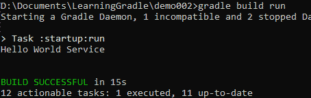

## 003-Publishing on maven repository

First, just take the demo002 and copy as demo003

### Publishin on local directory

To ease the development i choosed to use a local Maven repository to share the libraries. Again supposing our projects are in the C:\Documents directory, my new repo will be placed in C:\Documents\maven directory

This local repo will be used to overcame the need for the one level max nesting of gradle projects

#### The main build.gradle

In the main build.gradle i will add an external variable. This is a variable that will be seen by all build.gradle-s inside the project. This will contain a reference to the our maven directory. Please note that i assume that exists one "container" (kind of pom) project with only direct childrens! No nesting!
 
	ext.repos = [
	        'LocalMaven'   : "file://${projectDir}/../maven"
	]
 
Then i have to tell all the subprojects to use this repository (as a source). I add this at the end of the main build.gradle. This means that all java-type subprojects will first search on the "LocalMaven" and then on the maven central.

Please note the "afterealuate" followed by a kind of lambda expression. This means that first is evaluated the subprojecet build.gradle and then the part inside afterEvaluate is parsed. And the variable project will contain the evaluated project data. If you try to remove it the version that is inside the subproject does not yet exists whilst the project name, founded via directory name, exists.

    subprojects {
        afterEvaluate { project ->
            plugins.withType(JavaPlugin) {
                repositories {
                    maven {
                        name = 'LocalMaven'
                        url = uri(repos.LocalMaven)
                    }
                    mavenCentral()
                    ...

To demonstrate the previous statement you can add some line and see the differences

    subprojects{
    	println project.name
    	println project.version
    	afterEvaluate { project ->
    		println project.name
    		println project.version
            ...

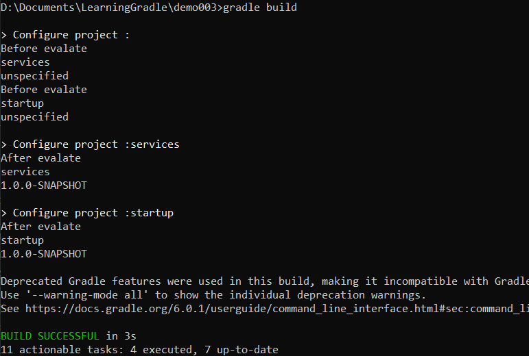

At last i have to tell the projects that publishes artifacts to use the local maven repo. Adding the following to the previously created "subprojects" section.

    subprojects {
        afterEvaluate { project ->
            plugins.withType(JavaPlugin) {
            	...
            }
            plugins.withType(MavenPublishPlugin) {
                publishing {
                    publications {
                        mavenJava(MavenPublication) {
                            from project.components.java
                        }
                    }
                    repositories {
                        maven {
                            name = 'LocalMaven'
                            url = uri(repos.LocalMaven)
                        }
                    ...

Remember to close the curly braces!!!!

#### Publishing the services

To publish the services on our local repository it would be enough to add the mavne-publish plugin to the build.gradle, resulting in the following. This because we already handled the publishing behaviour in the root project!

	plugins {
	   id 'java'
	   id 'java-library'
	   id 'maven-publish'
	}
	group 'org.kendar'
	version '1.0.0-SNAPSHOT'

Now running "gradle build publish" the new directory C:\Documents\maven have been created containing the poms, md5 and jars for the services!

### Publishing on global repository

#### Setup a simple maven repository

We can now download a ready copy of Artifactory to simulate a real repo, from [Artifactory Portable](http://www.kendar.org/hugefiles/artifactory-6.17.0.zip) extract in the same dir previously used for Gradle and Java, then run partifactory.bat.

A ui will then open and the first things to do are

 * Change login and password from the standard admin/password (i usually change this for demo purposes in !Passw0rd with a Zero instead of the "O" letter)
 * Create a Maven repository
 
#### Integrate the main build.gradle

First i add into the variables the addresses of the remote repositories

    ext.repos = [
            ...
            'RemoteMavenRelease'   : "http://localhost:8081/artifactory/libs-release",
            'RemoteMavenSnapshot'   : "http://localhost:8081/artifactory/libs-snapshot"
    ]

Now i will add the dependency on the "Remote Repo" to download files and to upload them

    subprojects {
        afterEvaluate { project ->
            plugins.withType(JavaPlugin) {
                repositories {
                    ...
                    maven {
                        name = 'RemoteMaven'
                        if (project.version.endsWith('-SNAPSHOT')) {
                            url = uri(repos.RemoteMavenSnapshot)
                        } else {
                            url = uri(repos.RemoteMavenRelease)
                        }
                        credentials {
                            username 'admin'
                            password '!Passw0rd'
                        }
                    }
                    ...
                    mavenCentral()
                }
            }
            plugins.withType(MavenPublishPlugin) {
                publishing {
                    ...
                    repositories {
                        ...
                        maven {
                            name = 'RemoteMaven'
                            if (project.version.endsWith('-SNAPSHOT')) {
                                url = uri(repos.RemoteMavenSnapshot)
                            } else {
                                url = uri(repos.RemoteMavenRelease)
                            }
                            credentials {
                                username 'admin'
                                password '!Passw0rd'
                            }
                    ...

A new task will then appear if we call gradle tasks: publishMavenJavaPublicationToRemoteMavenRepository (pretty long but this will be solved afterwards)

This when called will publish our data on the remote repo choosing the right path for snapshots and releases

## 004-Using "external" projects

Just take the demo003 and copy as demo004

Create then a new project demo004lib at the same level of the demo004 with a java-library type
 
### Initialize the repos on the library

Remove eveything but the plugins and add the maven plugin and the package/version

    plugins {
       id 'java'
       id 'java-library'
       id 'maven-publish'
    }
    group 'org.kendar'
    version '1.0.0-SNAPSHOT'

Add the repository definition into build.gradle

	ext.repos = [
	        'LocalMaven'   : "file://${projectDir}/../maven"
	]

And then the deployment part. Note that not using the "subprojects" we will add this part directly

    publishing {
        publications {
            mavenJava(MavenPublication) {
                from project.components.java
            }
        }
        repositories {
            maven {
                name = 'LocalMaven'
                url = uri(repos.LocalMaven)
            }
        }
    }

Remove the test class :)

Now we can "gradle build publish" the jar :) Remember that we added only the local maven dir repo!!!

### Use the library inside demo004

Inside the service library we will add the dependency

    dependencies {
    	implementation group: 'org.kendar', name: 'demo004lib', version: '1.0.0-SNAPSHOT'
    }

Now with the gradle build everything will work :)

We can do a "gradle build publish" and we will see the dependency added on the disk repository pom:

    ...
      <modelVersion>4.0.0</modelVersion>
      <groupId>org.kendar</groupId>
      <artifactId>services</artifactId>
      <version>1.0.0-SNAPSHOT</version>
      <dependencies>
        <dependency>
          <groupId>org.kendar</groupId>
          <artifactId>demo004lib</artifactId>
          <version>1.0.0-SNAPSHOT</version>
          ...

Everything is working fine!

### Add the dependency on the main project

We then would like to define the version of the dependency in the main project. In the main demo004 build.gradle we will add a new variable

    ext.dependenciesVersion = [
            'demo004lib'   : "1.0.0-SNAPSHOT"
    ]

And inside the "services" build gradle we will now write the following (note the version!)

    dependencies {
    	implementation group: 'org.kendar', name: 'demo004lib', 
    		version: dependenciesVersion.demo004lib
    }

We can now build with "gradle build publishMavenJavaPublicationToLocalMavenRepository"

And now we can see from the maven repo that everything have been published!

### Simplify the publishing task names

You have notice how long are the task names generated by gradle. There is a way to reduce all this.

Let's start with the demo004lib, here there is only one publish task In the build.gradle add the following. We are telling gradle that a new task exists depending on the original task "publish"

    task publishDir(dependsOn:'publish'){
    }

When running "gradle tasks --all" into the demo004lib just modified appears a new task!

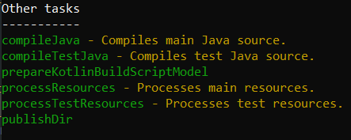

And running it will publish the artifact to the local repository

It is now possible to do the same. Running "gradle tasks" the relevant lines are

 * publishMavenJavaPublicationToMavenLocal: Generate automatically to publish inside the local .m2 maven cache
 * publishMavenJavaPublicationToLocalMavenRepository: To publish on OUR local repo. Note the "LocalMaven Repository"
 * publishMavenJavaPublicationToRemoteMavenRepository: To publish on OUR remote repo. Note the "RemoteMaven Repository"

Inside the demo004 build.gradle we can then add in afterEvaluate the needed tasks. Of course in the section of the subprojects containing the MavenPublishPlugin (maven)

	plugins.withType(MavenPublishPlugin) {
		...
		task publishDir(dependsOn:'publishMavenJavaPublicationToLocalMavenRepository'){}

		task publishRemote(dependsOn:'publishMavenJavaPublicationToRemoteMavenRepository'){}

		task publishAll(){
			dependsOn 'publishDir'
			dependsOn 'publishRemote'
		}
		...

Running "gradle publishAll" will spread our jars!!

## Using Spring boot

Copy then the demo003 to demo005! I choose to transform the startup project in a Spring boot application!

### Choose the version

First we should add the version of the plugins that are needed to build a spring boot app.

Two plugins will be used for this target with a new ext.version array in the build.gradle

	ext.versions = [
	        'SpringBoot'        : '2.2.2.RELEASE',
	        'SpringDependencies': '1.0.8.RELEASE'
	]

### Adding the spring boot plugins!

Inside the startup project the following is needed. To build the project we need the following libs in classpath.
The versions variable contains the depndency version. The rest of classpath is taken from Maven Central.

This section must be BEFORE the plugin section!

	buildscript {
	    dependencies {
	        classpath 'org.springframework.boot:spring-boot-gradle-plugin:'+versions.SpringBoot,
	                'io.spring.gradle:dependency-management-plugin:'+versions.SpringDependencies
	    }
	}
	
	plugins {
		...

Right after the plugins we apply the plugins to the project

	plugins {
		...
	}
	
	apply plugin:'org.springframework.boot'
	apply plugin:'io.spring.dependency-management'
	
And finally the plugin usage. Note the versions.SpringBoot in the first line!!
The with dependency constraint we remove the optional dependency snakeyaml

Please notice the difference of declarations of the boot dependencies and boot starter web. Those are two of the allowed styles for this declaration. The former is only a shortcut declaration

	dependencies {
		... //Other dependencies
	    implementation group: 'org.springframework.boot', name: 'spring-boot-dependencies', version: versions.SpringBoot
	    implementation 'org.springframework.boot:spring-boot-starter-web:'+versions.SpringBoot

	    testImplementation 'org.springframework.boot:spring-boot-starter-test:'+versions.SpringBoot

	    components {
	        withModule('org.springframework:spring-beans') {
	            allVariants {
	                withDependencyConstraints {
	                    it.findAll { it.name == 'snakeyaml' }
	                    	.each { it.version { strictly '1.19' } }
	                }
	            }
	        }
	    }
	}
	
Now you will see, runnign "gradle tasks" the bootRun task!

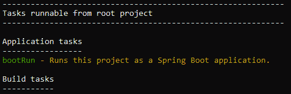

### Try everything

Add the a new source file: HelloGradleController.java

	package org.kendar.controllers;

	import org.springframework.web.bind.annotation.GetMapping;
	import org.springframework.web.bind.annotation.RestController;

	@RestController("/")
	public class HelloGradleController {

	    @GetMapping
	    public String helloGradle() {
	        return "Hello Gradle!";
	    }
	}
	
And modify the main to the following

	package org.kendar;

	import org.springframework.boot.SpringApplication;
	import org.springframework.boot.autoconfigure.SpringBootApplication;

	import java.util.Collections;

	@SpringBootApplication
	public class HelloWorld {
	    public static void main(String[] args) {
	        SpringApplication app = new SpringApplication(HelloWorld.class);
	        app.setDefaultProperties(Collections.singletonMap("server.port", "8094"));
	        app.run(args);
	    }
	}
	
Now requiring "gradle bootRun" you can go to http://localhost:8094 and see a fantastic "Hello Gradle"

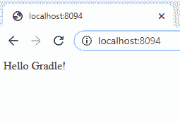
	
## Adding Junit and JaCoCo

Create a new project demo006, java application with JUnit 4 and package "org.kendar"

### JUnit

Now you can see into the dependencies the following part, JUnit. You could then use the same idea from the previous parts if you have a multimodule project: adding the subprojects/afterEvaluate pattern, and a variable to declare the dependency version

	dependencies {
		...
	    testImplementation 'junit:junit:4.12'
	}
	
You can then run "gradle test"

### JaCoCo

Add then the jacoco plugin in the build.gradle

	plugins {
		...
	    id 'jacoco'
	}
	
And declare the JaCoCo version with the directory to use for the reports

	jacoco {
	    toolVersion = "0.8.5"
	}
	
Then you can configure JaCoCo output

	jacocoTestReport {
	    reports {
	        xml.enabled false
	        csv.enabled false
	        html.destination file("${buildDir}/jacocoHtml")
	    }
	}
	
And the rules to break the builds if coverage is not met

	jacocoTestCoverageVerification {
	    violationRules {
	        rule {
	            limit {
	                minimum = 0.5
	            }
	        }

	        rule {
	            enabled = false
	            element = 'CLASS'
	            includes = ['org.gradle.*']

	            limit {
	                counter = 'LINE'
	                value = 'TOTALCOUNT'
	                maximum = 0.3
	            }
	        }
	    }
	}
	
Then running "gradle clean check jacocoTestReport" You will generate the report into "demo006\build\jacocoHtml" dir

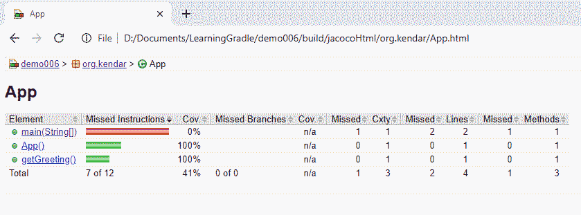

## Profiles

Clone the project demo002 into demo007

Profiles in gradle can be simulated in various way

First we should have a way to define a default profile. Here an environment variable is used. Simply add it to the main build.gradle

	if (!hasProperty('buildProfile')) ext.buildProfile = 'default'
	
### Properties for the build script

Now a new directory demo007/profiles is created containing two files

 * default.properties
 
	deploymentServer=localhost
	
 * prod.properties
 
 	deploymentServer=production.com

We can read the content of these into gradle's ext variable. Hem.. had you noticed some plain Java?? 

	Properties props = new Properties()
	props.load(new FileInputStream(project.rootDir.path+'/profiles/'+ext.buildProfile+'.properties'))
	props.each{prop->
		project.ext.set(prop.key,prop.value)
	}

And of course use it inside all our scripts

	println 'Deployment Target: ' + ext.deploymentServer
	
### Java properties files

It is also possible to use specific property files to include in the various projects. To give an example you can create the directories demo007/profiles/default and demo007/profiles/prod containing the environment specific properties for the project

 * default\environment.properties
 
	maxThreads=1
 
 * prod\environment.properties
 
	maxThreads=10000
 
At first is needed a variable containing the demo007 path, this must be set inside the main build.gradle and used by all the subprojects

	ext.rootDir='file://${projectDir}'
	
Then inside the subprojects we can add the specific files. For example in startup/build.gradle. Note that we are using the "ext" variables defined inside the root project!

	sourceSets {
		main {
			java{
				resources {
					srcDir 'file://'+rootDir+'/profiles/'+buildProfile
					include 'environment.properties'
					output.resourcesDir='${buildDir}/resources/main'
				}
			}
		}
	}

Then changing the main class to the following, it would be possible to print the content of the resource!

	package org.kendar;
	
	import java.io.IOException;
	import java.util.Properties;
	
	public class HelloWorld {
	    public static void main(String[] args) {
	    	HelloWorldService service = new HelloWorldService();
	    	service.printHello();
	    	
	    	Properties props = new Properties();
		    try 
		    {
		        props.load(HelloWorld.class.getClassLoader().getResourceAsStream("environment.properties"));
		    } catch (IOException e) {
		        e.printStackTrace();
		    }
		    System.out.println("I use maxThreads: " + props.getProperty("maxThreads"));
	    }
	}

Running "gradle run" will result in the following

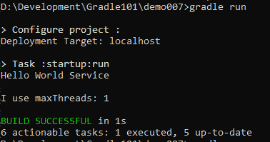

While adding a parameter

	gradle run -PbuildProfile=prod

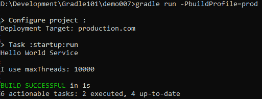

Notice the "maxThreads" and Deplyoment target values!!

## Including NodeJs builds

